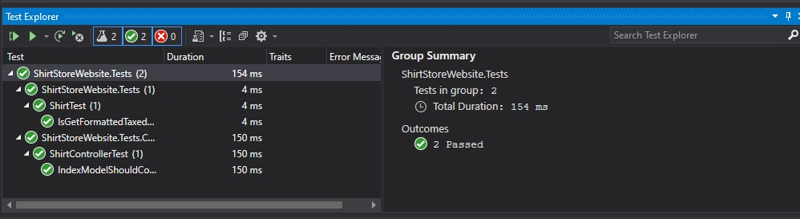

# Module 10: Testing and Troubleshooting

## Lab: Testing and Troubleshooting

1. **Nombres y apellidos:** Francisco Javier Moreno Quevedo
2. **Fecha:** 02/12/2020
3. **Resumen del Ejercicio:** implementar un log en el proyecto
4. **Dificultad o problemas presentados y como se resolvieron:** Ninguna

Ejercicio 5: Adding Logging

- Añadimos un  fichero  appsetting de desarrollo **appsettings.development.json** 

- Añadimos un  fichero  appsetting de produccion **appsettings.production.json** 

- EN el program.cs añadimos el codigo para que se cree el fichero de log dependiendo del entorno

- EN el controlador Shirt inyectamos la dependencia en el constructor el log y añadimos la funcionalidad

- Testeamos el controlador usando mocking framework

- Ejecutamos los test

  

  

  

- corremos la aplicacion en modo desarrollo y vemos los log

  

- corremos la aplicacion en modo produccion y provocamos un error

  

  

- SI hacemos otra acción que no produce error no se refleja en el log

